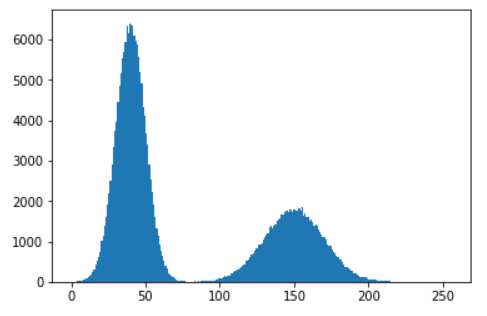
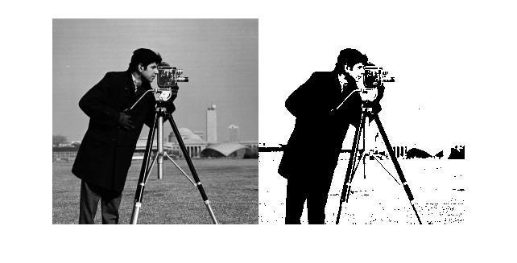
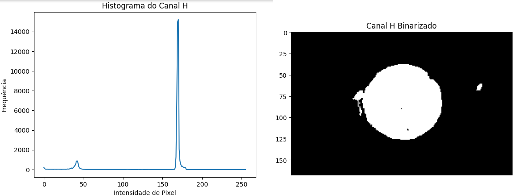
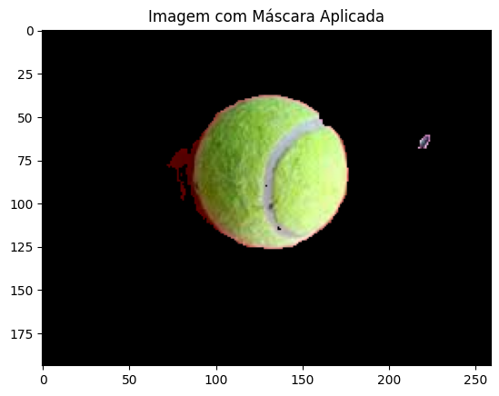
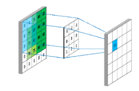
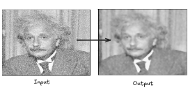
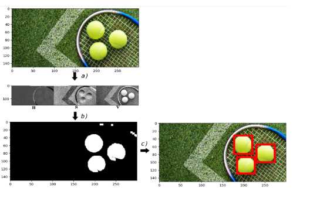
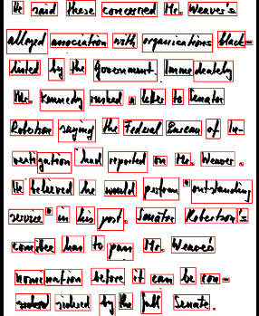
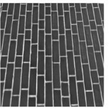

# Simulado-de-Prova-Vis.Comput

Este simulado direciona os estudos sobre os temas que podem ser cobrados. As questões podem aparecer em formatos como: discursiva, múltipla escolha, verdadeiro ou falso, validação de algoritmos, entre outros. 

## Fundamentos de Imagens Digitais

1. O que é um pixel e o que ele representa?
2. Qual a relação entre resolução e tamanho da imagem?
3. Uma imagem maior é necessariamente uma imagem com mais resolução? Discuta sobre isso
4. Como a cor é representada na imagem digital?
5. Por que ao isolar cada canal de cor, as imagens resultantes são em níveis de cinza?
6. Qual a diferença básica entre os sistemas de cor RGB e HSV?
7. Cite uma aplicação do sistema de cor HSV no processamento de imagens.

## Processamento Básico de Imagens Digitais

1. O que é um histograma de imagem? Cite algumas situações em que ele pode ser aplicado.
2. O que é o processo de binarização (threshold)?
3. Dado o histograma abaixo, qual o valor de threshold indicado? 
    
    
    
4. A imagem abaixo é resultante de um processo de binarização? 

    

1. Porque o sistema de cor RGB não é tão eficiente para segmentação? 

1. Imagine que você tenha que segmentar um objeto de cor vermelha (tomate). Discuta os limites da solução usando RGB. Leve em conta o split dos canais e o histograma da cor vermelha, abaixo representados:

    

    

1. Abaixo é proposto um algoritmo de segmentação para bolas de tennis. Responda:
    1. O algoritmo usa qual espaço de cor?
    2. Qual canal foi usado para segmentação ? Qual o motivo?
    3. Qual a análise realizada para a definição do threshold em 160?

```python
import cv2
import matplotlib.pyplot as plt

!wget 'https://encrypted-tbn0.gstatic.com/images?q=tbn:ANd9GcRPNmu7yCR3QemtNCgfY0QOOnW_Vg0arczF38Dumv2Vayx9E7IMwQbMUqApXJW8nxz6pXc&usqp=CAU' -O 'tennis_ball.jpg'
# Carrega a imagem
img = cv2.imread('tennis_ball.jpg')

# Converte a imagem para o espaço de cores HSV
hsv_img = cv2.cvtColor(img, cv2.COLOR_BGR2HSV)

# Separa os canais HSV
h, s, v = cv2.split(hsv_img)

# Plota os canais HSV
plt.figure(figsize=(15, 5))
plt.subplot(1, 3, 1)
plt.imshow(h, cmap='gray')
plt.title('Canal H')
plt.subplot(1, 3, 2)
plt.imshow(s, cmap='gray')
plt.title('Canal S')
plt.subplot(1, 3, 3)
plt.imshow(v, cmap='gray')
plt.title('Canal V')
plt.show()
```


```python
import matplotlib.pyplot as plt
# Calcula o histograma do canal H
hist_h = cv2.calcHist([h], [0], None, [256], [0, 256])

# Plota o histograma do canal H
plt.plot(hist_h)
plt.title('Histograma do Canal H')
plt.xlabel('Intensidade de Pixel')
plt.ylabel('Frequência')
plt.show()

# Segmenta o canal H com threshold em 160
ret, thresh_h = cv2.threshold(h, 160, 255, cv2.THRESH_BINARY_INV)

# Mostra a imagem binarizada do canal H
plt.imshow(cv2.cvtColor(thresh_h, cv2.COLOR_GRAY2BGR))
plt.title('Canal H Binarizado')
plt.show()

```



```python
result = cv2.bitwise_and(img, img, mask=thresh_h)

# Mostra a imagem com a máscara aplicada
plt.imshow(cv2.cvtColor(result, cv2.COLOR_BGR2RGB))
plt.title('Imagem com Máscara Aplicada')
plt.show()

```



# Convoluções

1. O que é uma Convolução ? 
2. Que técnicas utilizam convolução? Cite ao menos três
3. Qual a diferença entre um filtro da média e mediana? Em termos matématicos e em termos de resultados finais. (Redução ou espalhamento do ruído?)
4. Acerca de Operações Morfológicas em Imagens:
   
    a. O que é uma operação de Erosão (erode)?
   
    b. O que é uma operação de Dilatação (dilate)?
   
    c. O que é uma operação de Abertura (open)?
   
    d. O que é uma operação de Fechamento (Close)?
   
    
6. Que operações estão sendo realizadas abaixo ? 
    1. Exemplo 1
    
    
    
    b. Exemplo 2
    

    

7. A Figura abaixo representa o que ? 
    
    
    
    1. Histograma
    2. Convolução
    3. Binarização

8. Qual a provável técnica abaixo: 
    
    
    
    1. Binarização
    2. Filtre da Média ou Mediana
    3. Conversão de Espaço de Cor

9. O processo abaixo utiliza morfologia matemática. Defina a ordem das operações

    

# Pipeline de Segmentação

1. Crie um pseudo-código para o seguinte pipeline: 
    1. Encontrar bolas de Tennis
    
    
    

    2. Segmente os componentes de texto:

    

# Descritores de características

1. Dado a imagem abaixo, que tipo de descritor de características voce decidiria usar, assinale uma opção:

    

    a. Forma / Borda
   
    b. Textura
   
    c. Projeção de Histograma

3. Dado a imagem abaixo, apos realizar a segmentação, que tipo de descritor de características voce decidiria usar para diferenciar as moedas, assinale uma opção:
    
    
    

    a. Forma / Borda
   
    b. Textura
   
    c. Projeção de Histograma

4. Imagine um problema em que voce tenha que classificar os dois tipos de objetos abaixo. Que tipo de descritor seria mais adequado? Considere os objetos já segmentados

    

    a. Forma / Borda

    b. Textura

    c. Projeção de Histograma
